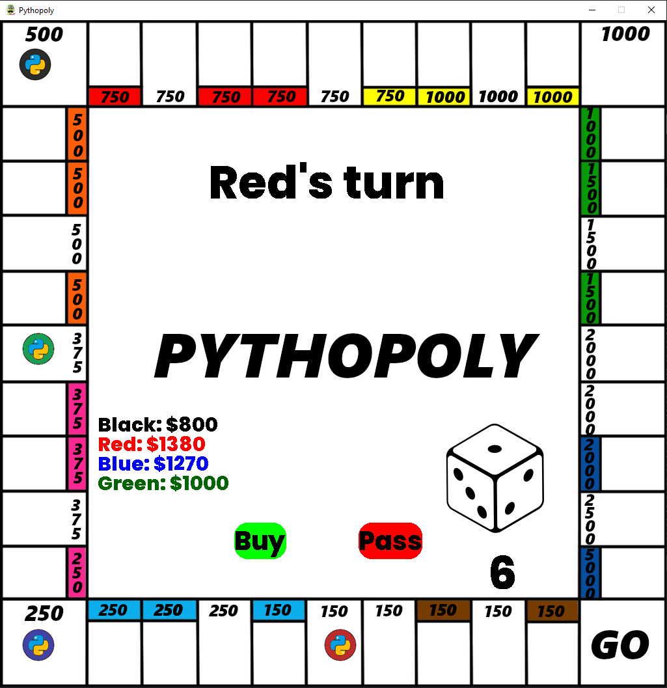

 

  
<h1 align="center">Pythopoly</h1>
A Monopoly-inspired board game written in Python!

Created by: **Amar Jilani** 

## About the Project 
Pythopoly is a multiplayer real-estate based board game. A total of 4 people can play! This simplified Monpoly-inspired game allows you to compete with your friends to outlast them in the real estate world! 
This project was built using **Python**, with the GUI developed using **Pygame**. 

## Rules
The rules are simple. Roll the dice and move that many spaces. Choose whether you want to buy the property. If the property is already owned by someone else, you have to pay rent!
The game ends when all but one player has no money left. 

## Demo 
Here's a screenshot of the board!

You can click on the dice to roll a number, then click on Buy or Pass depending on whether you want to buy that space or not.

